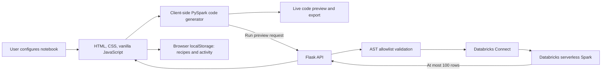

# LakeLoom — Interview Project Guide

## Elevator pitch

LakeLoom is a browser-based, low-code PySpark notebook builder for Databricks. A data engineer configures a source, chooses and orders transformations, and LakeLoom generates a readable Databricks notebook in real time. The generated code can be edited, previewed against Databricks, saved as a reusable recipe, or exported in several formats.

## The problem it addresses

Data engineers often repeat common DataFrame operations and hand-write boilerplate for reading data, cleaning and reshaping it, and writing results. This is flexible but can make pipelines slower to assemble and harder for less experienced Spark users to review. LakeLoom gives users a visual way to assemble those steps while keeping the resulting PySpark visible and editable. It is a code-generation and notebook-authoring tool; it does not hide the Spark code behind a proprietary runtime.

## Main user workflow

1. **Name the notebook and configure its source.** Choose a format, enter a catalog table or Databricks-accessible path, and choose a DataFrame variable name. Source formats include Delta, CSV, JSON, text, Parquet, Avro, ORC, and Iceberg. Delta tables can be read at a selected version. The Parquet snapshot field is informational because Parquet itself has no version history.
2. **Inspect source columns.** Selecting files automatically reads their column names and types through the app backend. CSV/JSON types are sampled; binary and table formats use metadata. A Databricks schema lookup is also available. Unknown input columns are highlighted in selected steps, with checks that account for earlier created, renamed, or removed columns. Inspection does not save files or ingest them into Databricks; data must still be available at the notebook's Databricks source path.
3. **Find and configure transformations.** Search the library, filter by category, expand a step’s settings, and select the steps to add. The current catalog contains 84 operations across shaping, data quality, filtering and sorting, expressions, date and time, analytics, arrays/maps/JSON, DataFrame utilities, and Delta/SCD operations. Examples include select/rename/drop columns, null handling, deduplication, conditional columns, date functions, aggregates, window functions, array expansion, JSON parsing, and SCD Type 1/2.
4. **Review the live notebook.** The PySpark source updates as settings change. Compatible operations can be rendered as a readable chained DataFrame pipeline; other operations are emitted as separate Databricks command cells. Generated output-column defaults are made distinct when similar transformations are selected.
5. **Edit, preview, and export.** Users can edit the generated code, copy it, reset it to the builder-generated version, or run a read-only preview when Databricks is connected. Exports include Databricks source (`.py`), Jupyter (`.ipynb`), text, Markdown, HTML, and a browser print view for PDF.
6. **Optionally configure a write step.** Choose an output format and destination, with applicable write mode, CSV header/delimiter, compression, and partition settings. Iceberg output supports create-or-replace and append options.
7. **Reuse local work.** Save and reload recipes. Overview, saved recipes, and activity history provide lightweight workspace navigation and are stored in the current browser.

## Transformation library

The filter categories shown in the builder are:

- **Select & shape:** select columns by name or position, create calculated columns, rename or remove fields, and standardize names.
- **Data quality:** null handling, distinct values, duplicate removal, key-based deduplication, and keeping the latest record.
- **Filter & sort:** filter/where conditions, sort by one or more columns, and limit row counts.
- **Columns & expressions:** conditional classification, text and numeric functions, and trimming string columns.
- **Date & time:** parse, format, extract, compare, or shift date values.
- **Analytics:** group and aggregate, pivot, ranking, and cumulative totals.
- **Arrays, maps & JSON:** create, inspect, transform, explode, parse, and flatten nested structures.
- **DataFrame tools:** create a typed DataFrame from a schema and sample rows.
- **Delta & SCD:** inspect, compare, restore, delete from, or vacuum Delta tables; generate SCD Type 1 and Type 2 merge logic.

The library is configuration-driven in `app.js`: each operation defines its category, description, input fields, and defaults, while generation code maps those settings into PySpark expressions.

## Architecture

- **Frontend:** `index.html`, `styles.css`, and `app.js`. The UI uses vanilla JavaScript rather than a frontend framework or compilation step. The browser builds notebook code and handles notebook exports and local recipe/history storage.
- **Backend:** `app.py` uses Flask to serve the interface and expose session-status and preview endpoints. A single allowlist controls which generated Python syntax, imports, and PySpark operations can reach the preview executor.
- **Spark connection:** Databricks Connect 15.4 is used for serverless preview. In a local run, the configured Databricks profile supplies the identity. In Databricks Apps, identity is read from the Apps proxy headers and preview runs using the app’s service principal.
- **Deployment:** `app.yaml` starts the Flask app through Gunicorn in Databricks Apps. `build_windows.bat` and `.github/workflows/windows-exe.yml` provide a Windows packaging route that launches the local web app in a browser.

## Preview and security boundaries

The preview endpoint validates the notebook code before execution. It limits accepted code size, checks the DataFrame variable name, restricts imports and calls, and blocks write and table-management methods. It returns at most 100 rows and skips the generated output-write section. Delta administration and SCD operations are not enabled in preview because they can modify tables; they remain code-generation features for notebooks run with the appropriate Databricks permissions.

The browser does not receive Databricks access tokens. Local recipe and activity data stay in browser storage; they are not synced to an account or server. The run-history screen is local notebook/recipe activity, not a history of Databricks job executions.

## Technology summary

| Area | Technology |
|---|---|
| UI | HTML, CSS, vanilla JavaScript |
| Web server/API | Python, Flask |
| Distributed processing | PySpark through Databricks Connect |
| Target platform | Databricks Apps / serverless compute, with local development mode |
| Local persistence | Browser `localStorage` |
| Windows packaging | PyInstaller, Python 3.11, Windows build workflow |

## One-minute interview explanation

> I built LakeLoom, a visual PySpark notebook builder for Databricks. The user configures a source and selects operations from a categorized transformation library. The JavaScript frontend turns those settings into a readable Databricks notebook in real time, so the user can inspect and edit the actual code instead of being locked into a visual abstraction. There is also an optional Databricks Connect preview. The Flask backend validates preview code against an allowlist, skips writes, and returns up to 100 rows. Recipes and activity are stored locally in the browser, while Databricks authentication stays in the local profile or is handled by Databricks Apps. I focused on making notebook generation transparent, keeping preview read-only, and being clear about which data and history stay local.

## Interview questions to prepare for

**Why generate code instead of executing every setting through a backend?**  
The notebook is the primary deliverable. Users can review it, edit it, version it, and run it in their own Databricks workspace with their normal permissions.

**How does a builder setting become PySpark?**  
Each transformation has a definition with an ID, category, fields, and defaults. The generator reads the selected operations in selection order, converts their settings into PySpark expressions or code blocks, and wraps them in Databricks notebook command markers.

**How is preview different from a notebook run?**  
Preview executes the current pipeline through Databricks Connect, omits the write step, restricts the code it accepts, and returns up to 100 rows. It is for checking transformations, not for managing tables or running a full production job.

**What happens when someone selects a local file?**  
The UI helps form a Databricks path and sends the selected file to the app backend for schema inspection. It displays names and types and checks column references in selected steps. The file is not saved or ingested into Databricks; it must be made available to the Databricks workspace separately.

**What is persisted, and where?**  
Recipes, notebook name, and local activity are stored in browser `localStorage`. There is no account-level recipe synchronization or persistent job-run store in the current app.

**What would you improve next?**  
Possible next steps include account-backed recipe sharing, actual Databricks job submission and run history, broader automated coverage for generated-code cases, and making large transformation configurations easier to maintain as the catalog grows.

## Resume-ready bullets

- Built a visual PySpark notebook builder that generates editable Databricks notebooks from configurable source, transformation, and output settings.
- Implemented a categorized transformation catalog covering data shaping, quality, expressions, dates, analytics, nested data, Delta operations, and SCD patterns.
- Added a Flask preview API using Databricks Connect with AST allowlist validation, read-only execution, and a 100-row result limit.
- Added notebook export formats, browser-local recipe persistence, and a Windows PyInstaller packaging workflow.

**Accuracy note:** selected files are sent to the app for schema inspection without being saved or ingested into Databricks; preview does not perform output writes or Delta/SCD table-management steps; saved recipes and activity are browser-local rather than account-synced.
